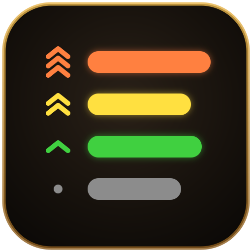
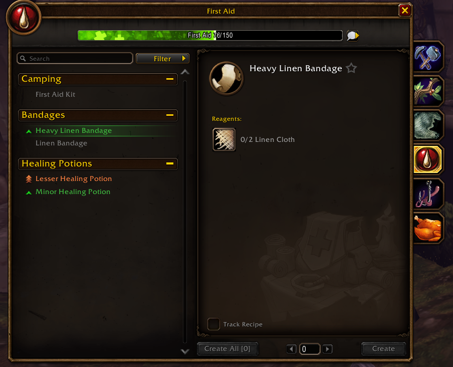

# ColorCraft

Classic recipe colors for the **WoW: Forever** professions window. Every recipe name is colored by
how likely it is to raise your skill, the way the old trade skill window did, so you can see at a
glance what to craft next.

| Color | Meaning |
|---|---|
| Orange | Always a skill-up |
| Yellow | Usually a skill-up |
| Green | Sometimes a skill-up |
| Gray | No skill-up anymore |

Blizzard's skill-up arrows stay where they are; the color is added to the name next to them.
Unlearned and locked recipes keep Blizzard's own colors, the mouse-over highlight still turns a
name white, and guild or NPC crafting lists (which have no skill-ups) are left alone.

No settings, no slash commands, no saved variables. Install it and open a profession.

## How it works

Each recipe row in Blizzard's professions list sets its name color when the row is built and when
the mouse leaves it. ColorCraft repaints the name right after both, through secure hooks, so
nothing of Blizzard's is replaced and the Craft button is never touched.

## Help and feedback

Questions, bugs and ideas: the [ShamanPower Discord](https://discord.gg/eCtNeBqE8U) has a channel for every addon.

## License

MIT, see [LICENSE](LICENSE).
